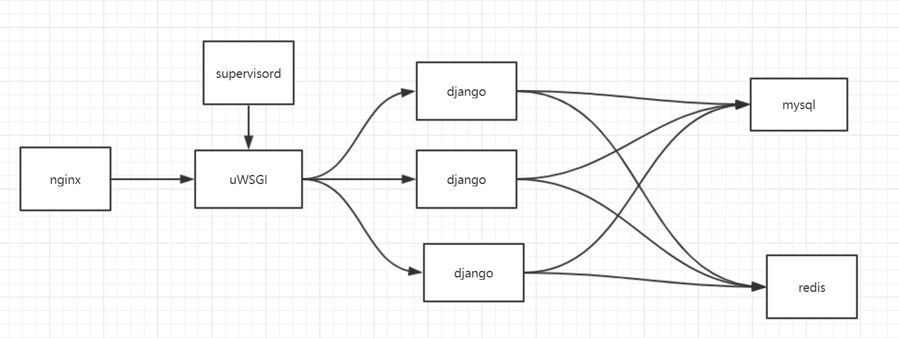
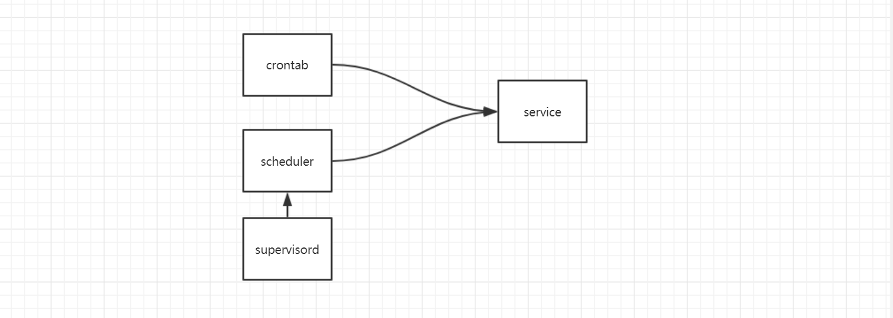

应用部署
===============

web部署框架

|web|

定时任务部署框架

|cron|

web应用部署
------------

1. web服务器配置
+++++++++++++

usgi.ini配置

    .. code::

    cat >>uwsgi.ini<<EOF
    [uwsgi]
    chdir = /project_dir
    static-map = /static=/project_dir/staticfiles
    module = wsgi:application
    http = :8080
    master = true
    processes = 8
    max-requests = 5000
    vacuum = True
    pid_file = order.pid
    EOF

    uwsgi --ini uwsgi.ini

2. 数据库配置

在django代码里面配置读写数据库

定时任务部署
-----------

1. 使用crontab

.. code::

    cat > usercron <<EOF
    */2 * * * * /usr/bin/python test.py
    EOF

    crontab -u root usercron
    service cron restart

2. 纯python，使用schedule

.. code::

    echo_supervisord_conf > supervisord_conf
    cat >> supervisord_conf << EOF
    [program:schedule]
    command=/usr/bin/python test.py
    autorestart=true
    user=root
    stdout_logfile=/data/scheduler.log
    stderr_logfile=/data/scheduler_error.log
    EOF

    supervisord -c supervisord_conf

docker 配置文件
--------------------

1. python

.. code::

    FROM python:3.6

    # 安装依赖
    COPY .requirements.txt /tmp

    RUN pip install -r /tmp/requirements.txt -i https://mirrors.aliyun.com/pypi/simple/ \
    && apt-get update \
    && apt-get install -y cron \
    && ln -fs /usr/share/zoneinfo/Asia/Shanghai /etc/localtime

    COPY . /data/gic-order
    WORKDIR /data

    EXPOSE 9088